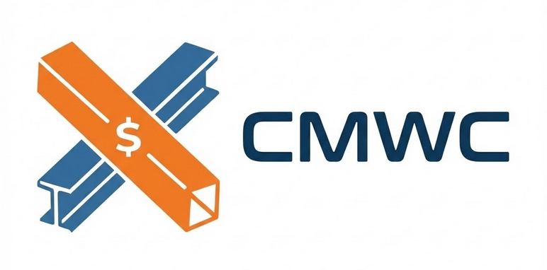

<div align="center">
  
</div>

# CMWC (Collision Matrix With Cost)

https://babinoff.github.io/CMWC/

Приложение для визуализации и расчета стоимости устранения коллизий в строительных проектах. Позволяет трансформировать классическую матрицу коллизий в интерактивную карту стоимости, используя данные из внешних источников и помощь LLM-ассистента.

## О проекте

CMWC (Collision Matrix With Cost) — это инструмент, который помогает BIM-менеджерам и руководителям проектов оценивать финансовые риски коллизий на ранних этапах. Вместо простого факта пересечения (П) или дублирования (Д), система позволяет оценить стоимость работ по устранению каждой конкретной коллизии.

### Основные возможности

*   **Матрица коллизий**: Классическое представление пересечений дисциплин (КР, АР, ВК, ОВ и т.д.) с возможностью детального анализа.
*   **Матрица стоимости**: Тепловая карта затрат, где каждая ячейка отображает диапазон стоимости устранения коллизии.
*   **LLM-ассистент**: Гибкая настройка подключения (поддержка стандартного OpenAI API). По умолчанию настроен на Mistral AI. Используется для:
    *   Парсинга расценок с внешних сайтов.
    *   Генерации сценариев устранения коллизий.
    *   Подбора работ и оценки их стоимости.
*   **Сценарии устранения**: Гибкая система моделирования различных способов решения проблем (например, "пробить отверстие" vs "обойти воздуховодом").
*   **Учет специфики дисциплин**: Ранжирование систем по сложности переноса (от "замороженного" бетона до гибких кабельных лотков).

## Технологический стек

*   **Frontend**: React 19, TypeScript, Vite
*   **AI**: Поддержка OpenAI-совместимых API (Mistral, Google Gemini, локальные модели и др.)
*   **Стилизация**: CSS Modules / Custom UI

## Запуск локально

**Предварительные требования:** Node.js (версии 18 или выше).

1.  Клонируйте репозиторий:
    ```bash
    git clone https://github.com/your-username/CollisionMatrixWithCostV3.git
    cd CollisionMatrixWithCostV3
    ```

2.  Установите зависимости:
    ```bash
    npm install
    ```

4.  Настройка LLM-ассистента:
    *   Откройте приложение в браузере.
    *   Перейдите на вкладку **"Настройки"**.
    *   Введите параметры вашего провайдера (например, Mistral AI или OpenAI):
        *   **URL провайдера**: Адрес API (по умолчанию настроен на Mistral).
        *   **API ключ**: Ваш секретный ключ.
        *   **Модель**: Название используемой модели.
    *   *Примечание: Приложение не использует переменные окружения (.env) для хранения ключей в целях безопасности клиентской части.*

5.  Запустите приложение:
    ```bash
    npm run dev
    ```

6.  Откройте [http://localhost:3000](http://localhost:3000) в браузере.

7.  **Загрузка демонстрационных данных**:
    Чтобы увидеть пример работы приложения с заполненными данными, есть два способа:

    **Способ 1: Быстрая загрузка (Рекомендуется)**
    *   Перейдите на вкладку **"Настройки"**.
    *   В разделе **"Управление данными"** нажмите кнопку **"Загрузить демо-данные"**.
    *   Приложение автоматически загрузит встроенный пример данных.

    **Способ 2: Ручной импорт**
    *   Перейдите на вкладку **"Настройки"**.
    *   В разделе **"Управление данными"** нажмите кнопку **"Импортировать БД (.json)"**.
    *   Выберите файл `example/cmwc_data.json` из папки проекта.

## Структура приложения

*   **Матрица коллизий**: Базовая таблица пересечений. Клик по категории открывает таблицу работ.
*   **Матрица стоимости**: Таблица с диапазонами затрат. Клик по ячейке открывает сценарии.
*   **Настройки**: Конфигурация подключения к LLM (API Key, модель).
*   **Журнал**: Логи запросов к LLM с подсчетом токенов.

## Ранги дисциплин (для LLM)

Приложение учитывает сложность переноса элементов:
1.  **КР (Конструктив)**: Катастрофическая стоимость (требует разрушения).
2.  **АР (Архитектура)**: Высокая стоимость (демонтаж, отделка).
3.  **ВК-Самотек**: Технологически сложно (уклоны).
4.  **ОВ-Магистрали**: Средняя/Высокая (заказ изделий).
5.  **Напорные системы**: Умеренная (фитинги).
6.  **ЭОМ/СС**: Низкая (гибкие трассы).

## Лицензия

[MIT](LICENSE)
